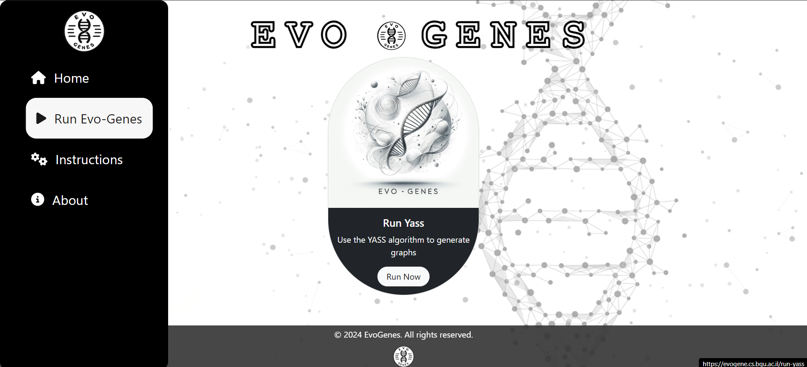
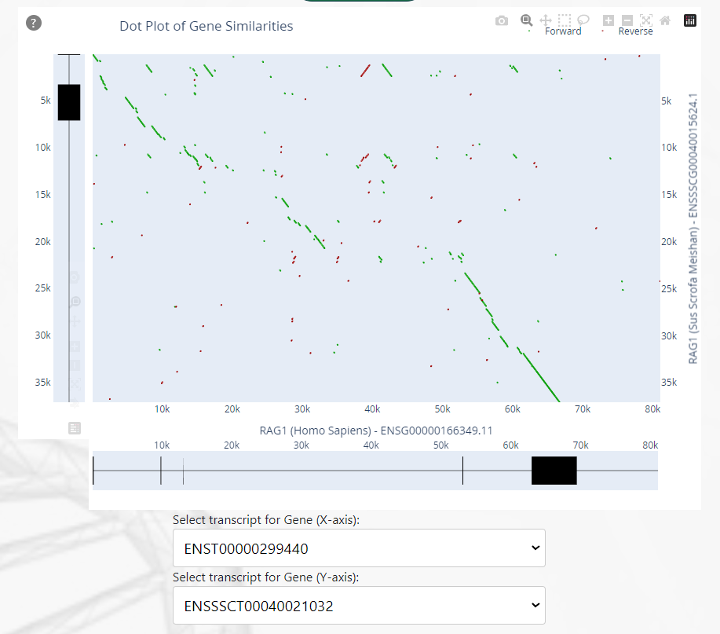
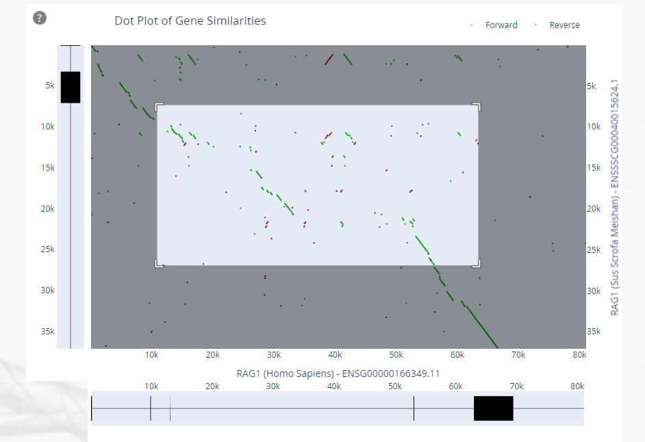
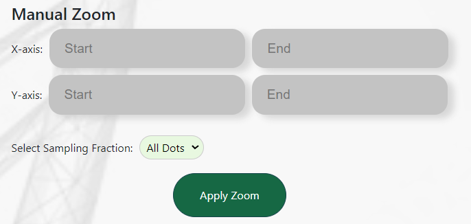

# Comprehensive Gene Visualization System - Evo-Genes

Visit our website here: [Evo-Genes](https://evogene.cs.bgu.ac.il)

Created by:
- Natalia Kataev
- Ayelet Moyal
- Maor Biton
- Assaf Shukrun

## Sections:

1. [Website for Gene Visualization](#website-for-gene-visualization)
2. [Getting Started](#getting-started)

---

## Website for Gene Visualization

Evo-Genes is a comprehensive gene visualization system. Our system addresses the complex challenge of comparing gene similarities across species while preserving the context of the original gene structure.
Existing tools lack the ability to simultaneously examine sequence similarities and structural differences between species. Evo-Genes fills this gap by providing a web-based platform that integrates server-side and client-side programming with the extensive Ensembl database. Our system features intuitive and visually engaging comparative gene sequence analysis, emphasizing exon display to optimize gene comparison.

---

## Getting Started

To start use our website enter the following link: [Evo-Genes](https://evogene.cs.bgu.ac.il)
You should see the home screen below. Now choose 'Run Now' button in the middle of the screen or throw the navigation bar on the left side and click
'Run Evo-Genes'

To start use the system you should pick two Gene Ensembl IDs and copy them to text boxes shows in the screen below:

In order to do so you can choose one of the options:
1. You can use the [Ensembl website](https://www.ensembl.org/). After you search on the website the specific gene you want to investigate you can copy the Gene Ensembl ID like in the circle on the example below (in the example the gene C1QA):

2. You can use our "Chosen Genes" on the start of the same page of our website. When clicking on one of the photos a pop up window will show and you can choose genes there and copy them to the text boxes below:

Example for a Result Screen:
The example taken for the next Gene Ensembl IDs: ENSSSCG00040015624 , ENSG00000166349
(All dots presented)

On the bottom of the graph there is an options to choose transcripts for each gene.

Zoom capabilities:
You can click and drag the mouse on the dotplot graph to zoom-in to a specific area you want.
The graph will scale respectively:

Alternatively you can use the manual zoom on the bottom of the page:

Note: The genes not always starts from 0 so if you encouter a bounderies error try a bigger number.

At the end you can use the screenshot button  and take a picture of the results you get to put it wherever you want.

---

### Important Notes:

1. The order of the gene Ensembl IDs dont matter (The algorithm takes the longest one to be the x-axis).
2. For large genes, in order to get fast results it is recommanded to use the "Select Sampling Fraction" option and dont select "All Dots".

<!-- Feel free to add more sections as necessary, such as:

- **Contributing:** Guidelines for contributing to the project.
- **License:** The license under which the project is distributed.
- **Contact:** How to reach out to the project maintainers or support team. -->
